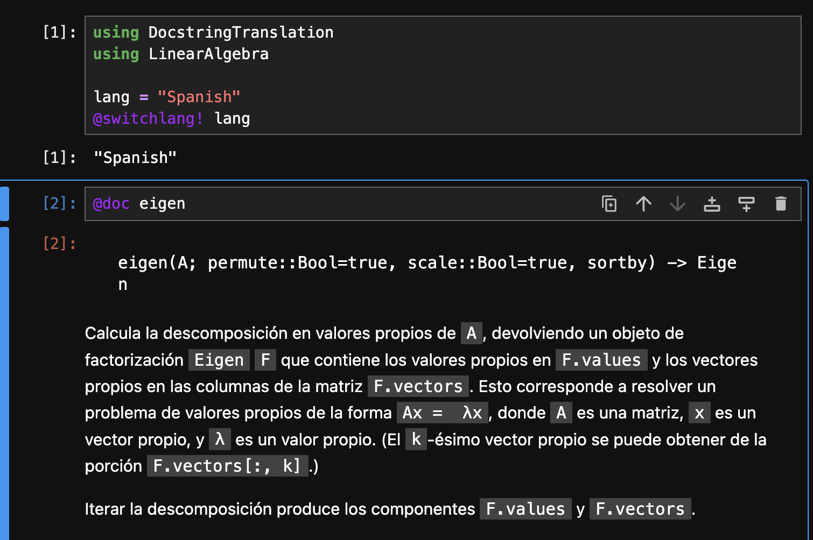
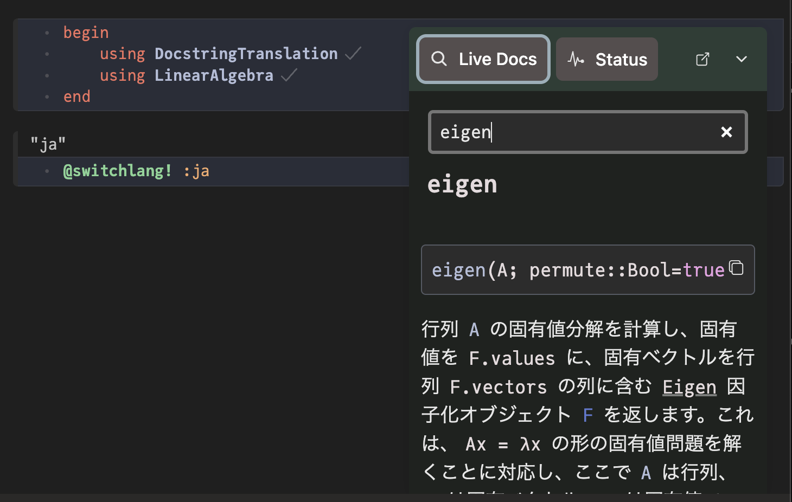
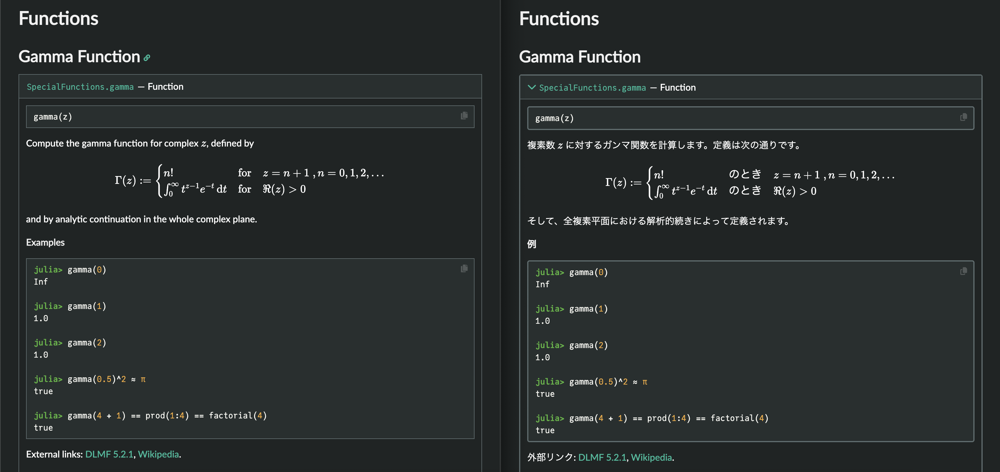

# 概要

- DocstringTranslation.jl の紹介
- Julia ドキュメントの多言語翻訳
- デモを実行

---

## 背景・課題

- Julia の公式ドキュメントは **英語** で書かれている
- 非英語圏の開発者にとって心理的・時間的コストが高い
  - みんな忙しい
- 最新情報は英語でしか提供されない

**解決策**: 機械翻訳を活用した自動翻訳システムの構築

---

## DocstringTranslation.jl

Julia の docstring を好きな言語に翻訳するパッケージ

:::: {.columns}

::: {.column width="50%"}

`@doc exp` (Original)

```julia
julia> @doc exp
  exp(x)

  Compute the natural base exponential of x, in other words ℯ^x.

  See also exp2, exp10 and cis.

  Examples
  ≡≡≡≡≡≡≡≡

  julia> exp(1.0)
  2.718281828459045

  julia> exp(im * pi) ≈ cis(pi)
  true

  exp(A::AbstractMatrix)

  Compute the matrix exponential of A, defined by

  e^A = \sum_{n=0}^{\infty} \frac{A^n}{n!}.

  For symmetric or Hermitian A, an eigendecomposition (eigen) is used, otherwise the scaling and squaring algorithm
  (see [^H05]) is chosen.

  │ [^H05]
  │
  │  Nicholas J. Higham, "The squaring and scaling method for the matrix exponential revisited", SIAM Journal
  │  on Matrix Analysis and Applications, 26(4), 2005, 1179-1193. doi:10.1137/090768539
  │  (https://doi.org/10.1137/090768539)

  Examples
  ≡≡≡≡≡≡≡≡

  julia> A = Matrix(1.0I, 2, 2)
  2×2 Matrix{Float64}:
   1.0  0.0
   0.0  1.0

  julia> exp(A)
  2×2 Matrix{Float64}:
   2.71828  0.0
   0.0      2.71828

```
:::

::: {.column width="50%"}

`@doc exp` (Translated into Japanese)

```julia
julia> ENV["OPENAI_API_KEY"] = "sk-<blah>"
julia> using DocstringTranslation
julia> @switchlang! :ja
julia> @doc exp
  exp(x)

  xの自然基底指数を計算します。言い換えれば、ℯ^xです。

  他にexp2、exp10、およびcisも参照してください。

  例
  ≡≡

  julia> exp(1.0)
  2.718281828459045

  julia> exp(im * pi) ≈ cis(pi)
  true

  exp(A::AbstractMatrix)

  行列 A の行列指数関数を計算します。これは次のように定義されます。

  e^A = \sum_{n=0}^{\infty} \frac{A^n}{n!}.

  対称行列またはエルミート行列 A
  の場合は、固有分解（eigen）が使用され、それ以外の場合はスケーリングと平方化アルゴリズムが選択されます（[^\H05]を参照）。

  │ [^H05]
  │
  │  Nicholas J. Higham, "The squaring and scaling method for the matrix exponential revisited", SIAM Journal
  │  on Matrix Analysis and Applications, 26(4), 2005, 1179-1193. doi:10.1137/090768539
  │  (https://doi.org/10.1137/090768539)

  例
  ≡≡

  julia> A = Matrix(1.0I, 2, 2)
  2×2 Matrix{Float64}:
   1.0  0.0
   0.0  1.0

  julia> exp(A)
  2×2 Matrix{Float64}:
   2.71828  0.0
   0.0      2.71828
```
:::

::::

---

## 翻訳の仕組み

- `@switchlang! :ja` は `Docs.parsedoc(d::DocStr)` メソッドを上書きする．

```julia
# Rough sketch
@eval function Docs.parsedoc(d::DocStr)
    if d.object === nothing
        md = Docs.formatdoc(d)
        md.meta[:module] = d.data[:module]
        md.meta[:path] = d.data[:path]
        begin # hack
          translated_md = translate_docstring_with_openai(md)
        end # hack
        d.object = translated_md
    end
    d.object
end
```

See the [actual implementation](https://github.com/AtelierArith/DocstringTranslation.jl/blob/77eb4e187d30c9e82a0e4f078742b5c2af7f0845/src/switchlang.jl#L24-L51) to learn more.

---

## Docstrings on IJulia.jl

We can read translated docstrings on Jupyter



---

## Live Docs on Pluto.jl

We can read translated docstrings on Pluto



---

### Translation of Documenter.jl based documents

```diff
--- a/docs/make.jl
+++ b/docs/make.jl
@@ -4,6 +4,10 @@ using DocumenterCitations
 # `using SpecialFunctions` for all doctests
 DocMeta.setdocmeta!(SpecialFunctions, :DocTestSetup, :(using SpecialFunctions); recursive=true)

+using DocstringTranslation
+@switchlang! :ja
+DocstringTranslation.switchtargetpackage!(SpecialFunctions)
+
 bib = CitationBibliography(
        joinpath(@__DIR__, "src", "refs.bi
b");
        style = :authoryear,
```

---

### Translation of Documenter.jl based documents




---

## 翻訳結果のキャッシュについて

- Scratch.jl を使って翻訳結果をローカル環境に保存
- REPL の起動時に毎回 API を呼び出すことを抑制する
- `<lang>.md` (e.g., `ja.md`) を編集することで翻訳結果を修正が可能
- 翻訳結果をユーザ間で共有可能

```
$ tree ~/.julia/scratchspaces/d404e13b-1f8e-41a5-a26a-0b758a0c6c97/translation
├── Base
│   └── 1.11
│       └── Math
│           └── 77be4ada26c623c913ebbdae5d8450a4dfe8f3cbf67837faac9d7193342d2bfe
│               ├── ja.md
│               └── original.md
└── LinearAlgebra
    └── 1.11
        └── 46c0494a8a2adffc6f71752b60448da1743997b5b1791b71e3830113e9b9cc46
            ├── ja.md
            └── original.md

8 directories, 4 files
```

---

## Julia マニュアルの翻訳結果

**多言語 Julia ドキュメント**:

- [日本語](https://atelierarith.github.io/UnofficialJuliaDoc-ja/)
- [韓国語](https://atelierarith.github.io/UnofficialJuliaDoc-ko/)
- [中国語](https://atelierarith.github.io/UnofficialJuliaDoc-zh/)
- [ドイツ語](https://atelierarith.github.io/UnofficialJuliaDoc-de/)
- [フランス語](https://atelierarith.github.io/UnofficialJuliaDoc-fr/)
- [スペイン語](https://atelierarith.github.io/UnofficialJuliaDoc-es/)

---

## その他

- DocstringTranslationOllamaBackend.jl (Ollama バックエンド)

---

## デモ

実際に翻訳機能を動かしてみましょう！

---

## まとめ

- Julia ドキュメントの多言語化を実現
- docstring と Documenter.jl の両方に対応
- 翻訳結果のキャッシュ機能で効率化
- 複数の翻訳バックエンドをサポート

**今後の展望**:
- 翻訳品質の向上
- より多くの言語への対応
- コミュニティでの翻訳結果共有

---

## ありがとうございました

**リポジトリ**:
- [DocstringTranslation.jl](https://github.com/AtelierArith/DocstringTranslation.jl)

